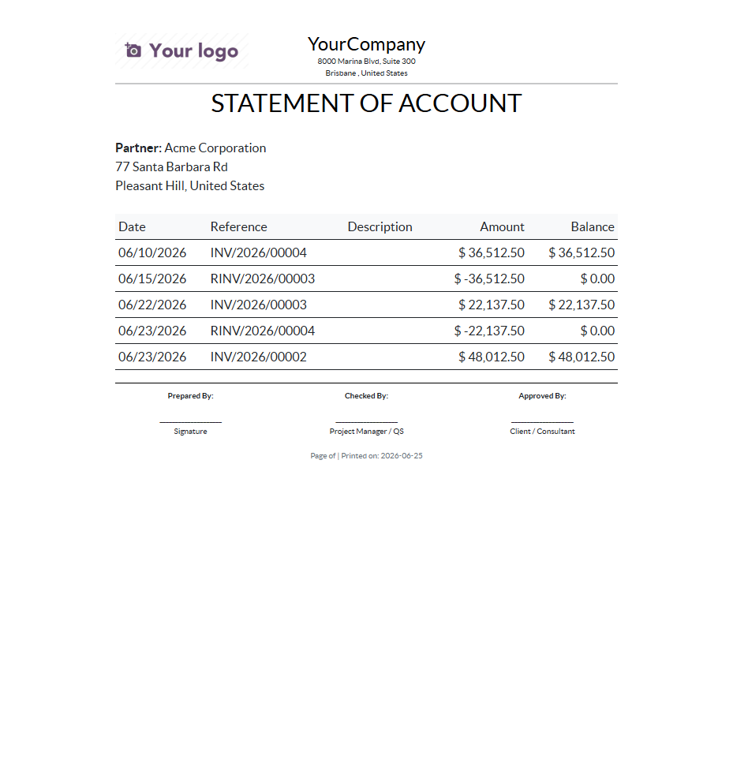
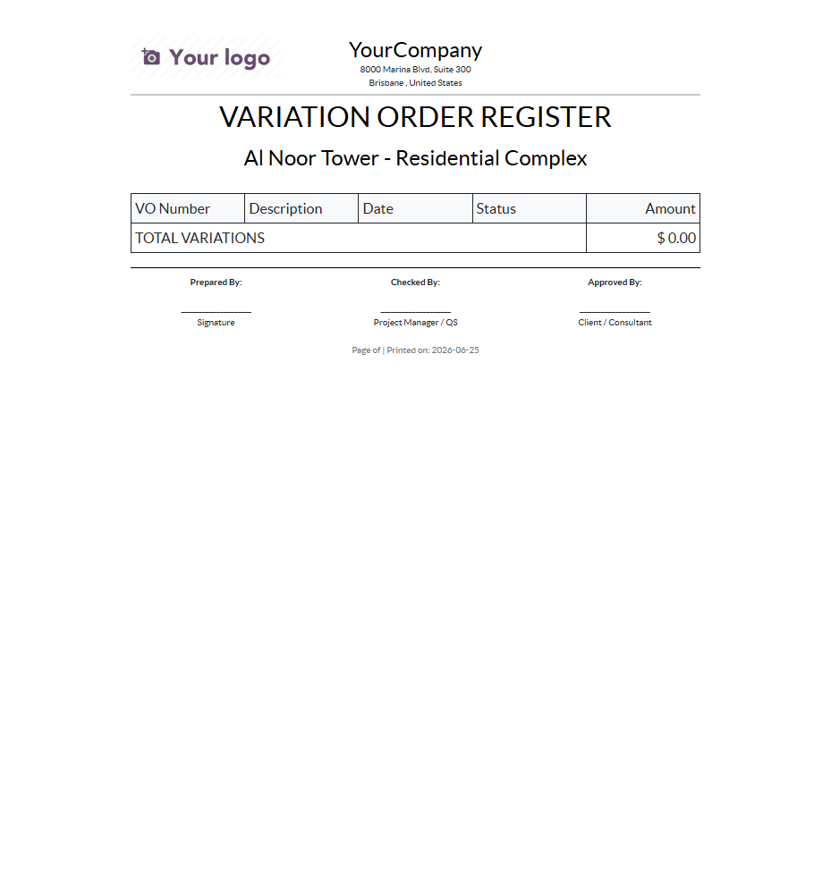
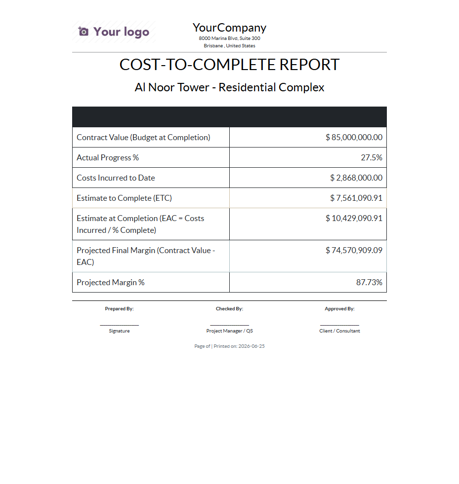
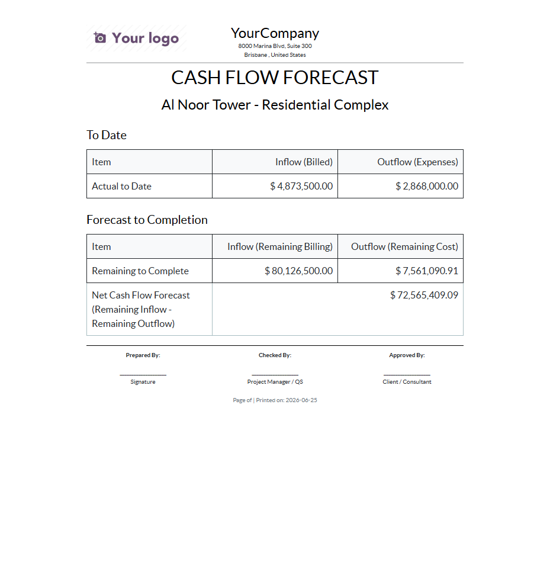
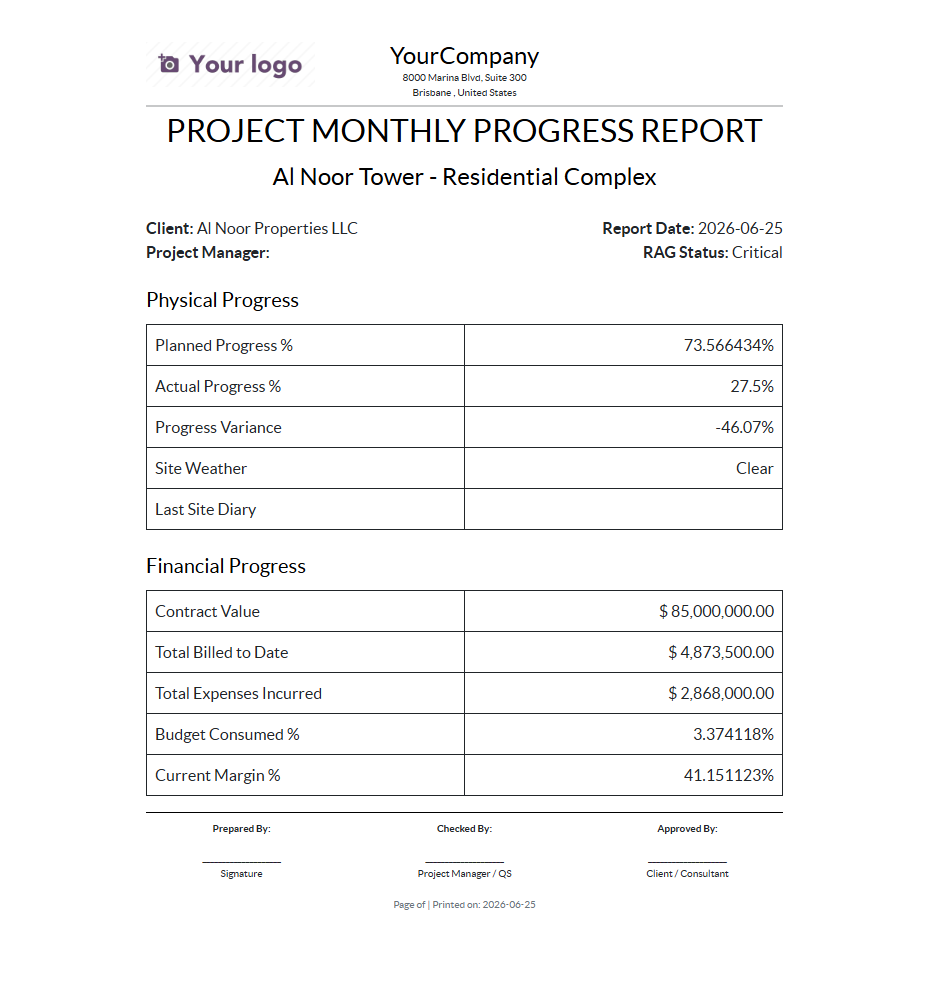
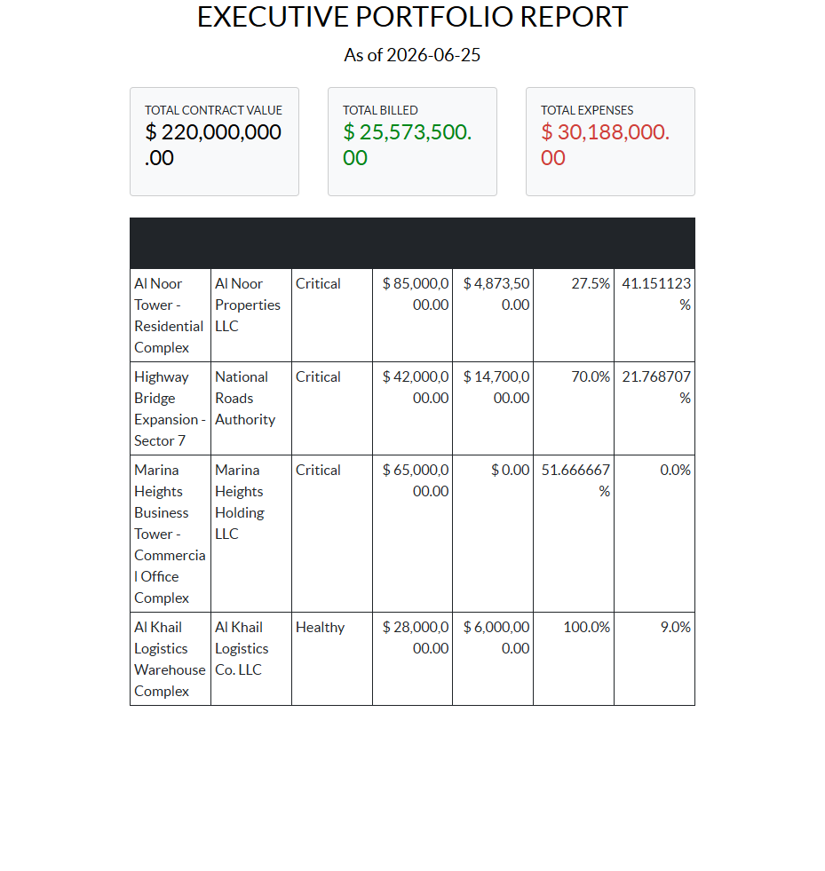
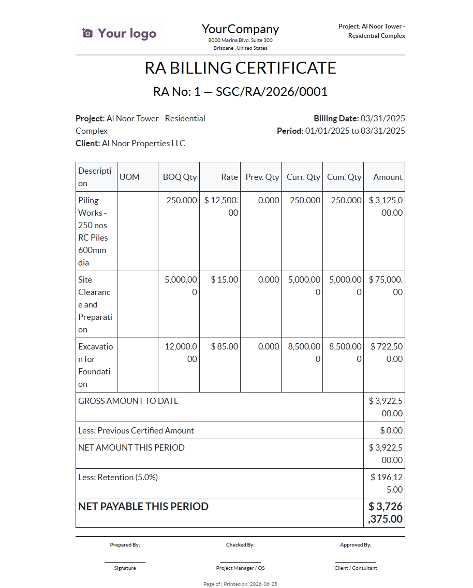
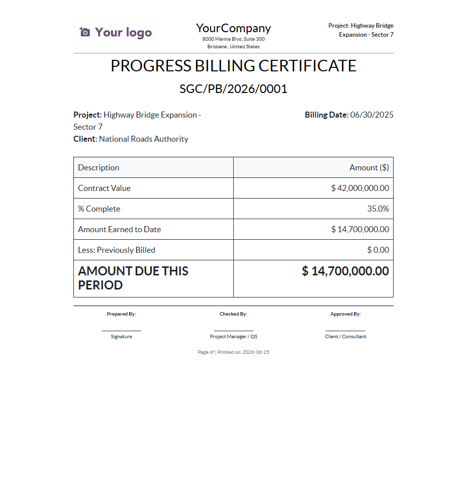

# SGC Construction Management — Reports Manual

This manual documents every report shipped by the **SGC Construction Management** module,
how to generate it, and what it contains. All reports below were verified end-to-end on the
live test instance (`test.sgctech.ai`, database `construction_management`) after the
report fixes were deployed.

> **Print menu vs. Reporting menu** — Record-bound reports (PDF and XLSX) appear in the
> **Print** dropdown of the relevant record's form/list view. The Executive Portfolio
> Report is generated from **Construction → Reporting → Executive Portfolio Report**.

---

## 1. Statement of Account (PDF)

- **Model:** `res.partner` (Customers / Vendors)
- **How to run:** Open a partner → **Print → Statement of Account**
- **Report:** `sgc_construction_management.report_soa_template`

A running ledger of all posted invoices and credit notes for the partner, with a
**running balance** column. Invoices add to the balance; refunds/credit notes subtract,
so the balance correctly nets out to the outstanding amount.

**Verified:** running balance accumulates correctly
(e.g. 36,512.50 → 0.00 → 22,137.50 → 0.00 → 48,012.50).

---

## 2. Variation Order (VO) Register (PDF)

- **Model:** `construction.project`
- **How to run:** Open a project → **Print → VO Register**
- **Report:** `sgc_construction_management.report_vo_register_template`

Lists every variation order on the project (VO number, description, date, status, amount)
and a **Total Variations** line. Amounts are pulled from the project's real VO records.

---

## 3. Cost-to-Complete Report (PDF)

- **Model:** `construction.project`
- **How to run:** Open a project → **Print → Cost-to-Complete Report**
- **Report:** `sgc_construction_management.report_cost_to_complete_template`

Earned-value style summary: Contract Value (Budget at Completion), costs incurred to date,
estimated cost to complete, and forecast final cost / margin.

---

## 4. Cash Flow Forecast (PDF)

- **Model:** `construction.project`
- **How to run:** Open a project → **Print → Cash Flow Forecast**
- **Report:** `sgc_construction_management.report_cash_flow_forecast_template`

Projected inflows (billings) vs. outflows (expenses) with actual-to-date figures.

---

## 5. Project Monthly Progress Report (PDF)

- **Model:** `construction.project`
- **How to run:** Open a project → **Print → Project Progress Report**
- **Report:** `sgc_construction_management.report_progress_report_template`

Monthly progress narrative including client, project manager, percentage complete,
milestones, and key metrics.

---

## 6. Executive Portfolio Report (PDF)

- **Model:** `construction.project` (all projects)
- **How to run:** **Construction → Reporting → Executive Portfolio Report**
- **Report:** `sgc_construction_management.report_executive_portfolio_template`

Portfolio-wide executive summary spanning all projects (one section per project),
generated through a server action over the full project set.

---

## 7. RA Billing Certificate (PDF)

- **Model:** `construction.ra.billing`
- **How to run:** Open an RA Billing record → **Print → RA Billing Certificate**
- **Report:** `sgc_construction_management.report_ra_billing_template`

Interim payment / running-account billing certificate showing BOQ lines with
previous, current, and cumulative quantities and amounts.

---

## 8. Progress Billing Certificate (PDF)

- **Model:** `construction.progress.billing`
- **How to run:** Open a Progress Billing record → **Print → Progress Billing Certificate**
- **Report:** `sgc_construction_management.report_progress_billing_template`

Milestone/percentage-based progress billing certificate.

---

## 9. Excel (XLSX) Exports

These produce downloadable `.xlsx` workbooks (via the `report_xlsx` engine).

| Report | Model | How to run | Report name |
|--------|-------|-----------|-------------|
| WIP Report (Excel) | `construction.project` | Project → **Print → WIP Report (Excel)** | `report_wip_xlsx` |
| RA Billing (Excel) | `construction.ra.billing` | RA Billing → **Print → RA Billing (Excel)** | `report_ra_billing_xlsx` |
| Project Profitability (Excel) | `construction.project` | Project → **Print → Project Profitability (Excel)** | `report_profitability_xlsx` |
| Statement of Account (XLSX) | `res.partner` | Partner form → **Statement of Account (XLSX)** stat button | custom controller `/sgc_construction_management/xlsx/soa/<id>` |

**Verified:** all four return a valid `.xlsx` file
(`application/vnd.openxmlformats-officedocument.spreadsheetml.sheet`, HTTP 200).

---

## Verification summary

| # | Report | Type | Status |
|---|--------|------|--------|
| 1 | Statement of Account | PDF | Verified |
| 2 | VO Register | PDF | Verified |
| 3 | Cost-to-Complete | PDF | Verified |
| 4 | Cash Flow Forecast | PDF | Verified |
| 5 | Project Progress Report | PDF | Verified |
| 6 | Executive Portfolio | PDF | Verified |
| 7 | RA Billing Certificate | PDF | Verified |
| 8 | Progress Billing Certificate | PDF | Verified |
| 9 | WIP / RA Billing / Profitability / SOA | XLSX | Verified |

All reports verified live on `test.sgctech.ai` (database `construction_management`).
